# Lab 2 - Enterprise app dev
## Question 1:
Users table with a username & hashed password field. Includes also a protected resource table (in the form of a products table).
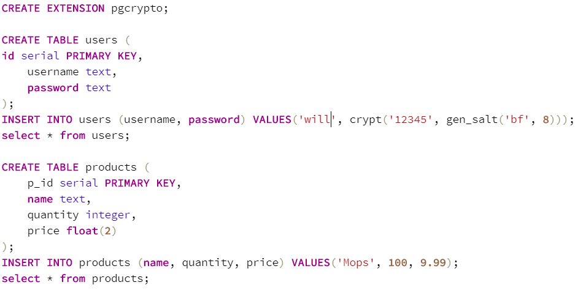

## Question 2: 
I created a login screen to demonstrate my (asynchronous) JWT implementation:
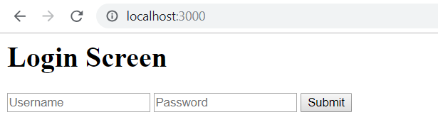  
This would take the username & password and pass them to the '/home' api end point. There they would be validated by hashing the passed in password and checking to see if there was any matching rows.  
If there was no match it would return a 401 status.  
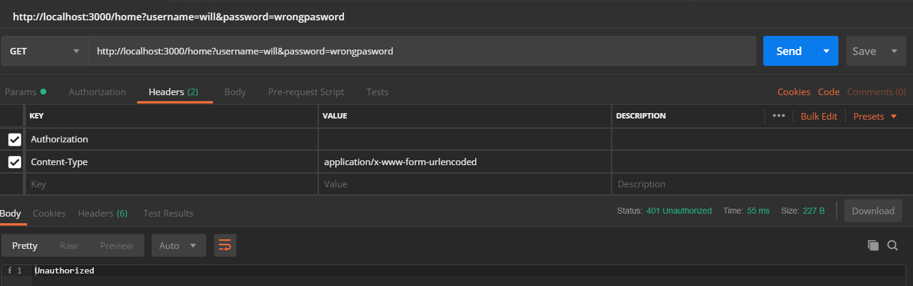  
If there was a match a JWT would be generated for the user, the user directed to a home page and the status set to 200. 
The token would have the claims set to the user id and expiration timestamp (expiry time was set to 1 hour after creation).
### Token claims
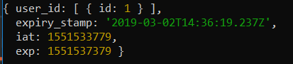
### Token generation

### Home Screen
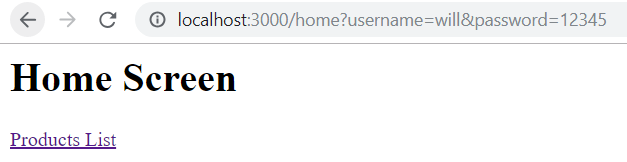
### Login success status
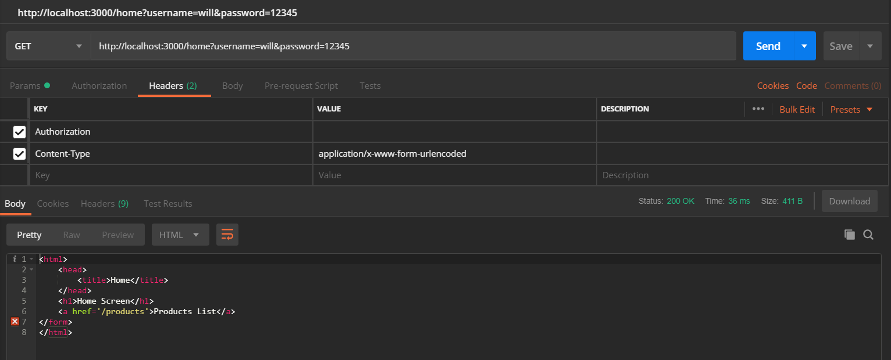
  
In order to access the protected resource table however, the token had to be validated by verifying  client tokens as bearer tokens in a HTTP Authorization header field.  
Failure to do this would return a 401 response.
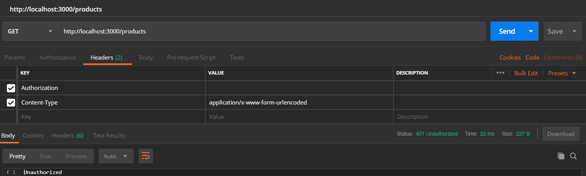
  
When the client token was validated the user was allowed access to the protected resource table (which in this case was a GET api end point that printed the contents of the 'products' table).
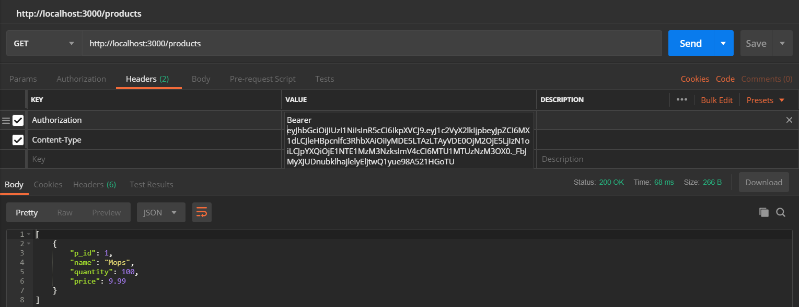

## Question 3:
I created a seperate apikeys table which was linked to the users table by their id. This table had a 160-bit access key and 320-bit secret key inserted.
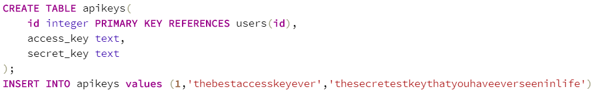

## Question 4:
### Code
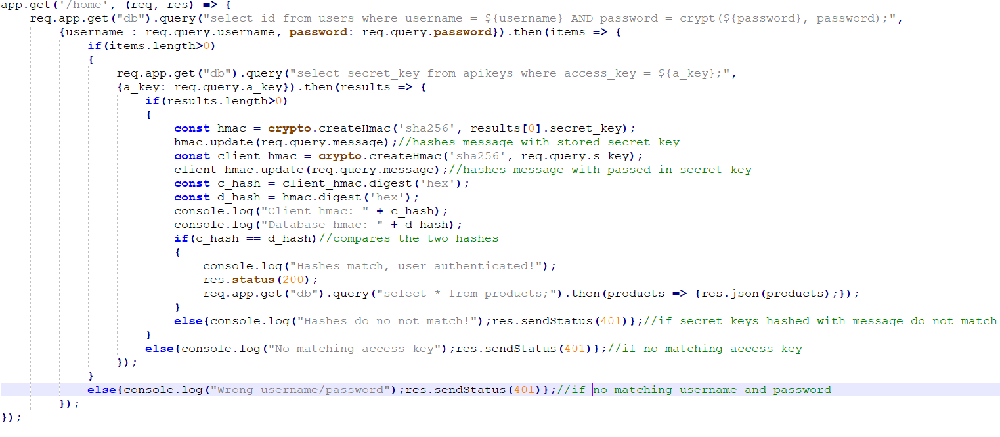
For the HMAC implementation, the user could only access the protected resource table if they provided the access key, secret key , username and password, (a message was optional).  
Failure to provide the correct values for any of these would return a 401 status.
### Wrong access key
#### Input

#### Error
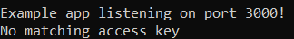
### Wrong secret key (would result in different hashes derived from message and secret key)
#### Input
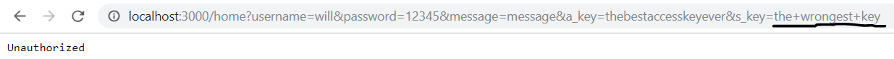
#### Error
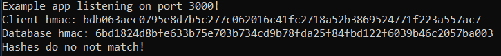  
If correct values where passed in the user would be validated, status set to 200 and access to the protected resource table granted.
#### Input
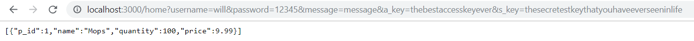
#### Output
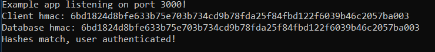
