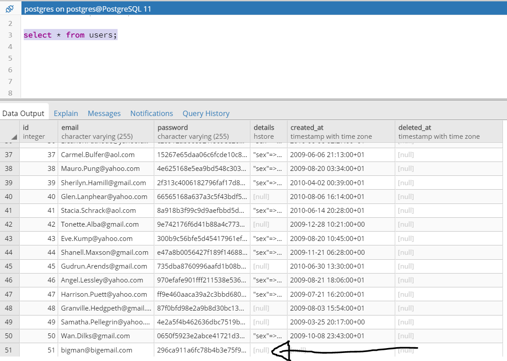

# Question 1:
## (1.0) - GET /users
### Code
app.get('/users', (req, res) => {req.app.get("db").query('select email, details from users order by created_at desc;').then(items => {
res.json(items);});});
### Output

## (1.1) - GET /users/:id
### Code
app.get('/users/:id', (req, res) => {
	var id = req.params.id;
	req.app.get("db").query('select email, details from users where id = ${id} order by created_at desc;',
		{id : req.params.id}).then(items => {
res.json(items);});});
### Output

## (1.2) - GET /products
### Code
app.get('/products', (req, res) => {req.app.get("db").query('select * from products order by price asc;').then(items => {
res.json(items);});});
### Output

## (1.3) - GET /products/:id
### Code
app.get('/products/:id', (req, res) => {
	var id = req.params.id;
	req.app.get("db").query('select * from products where id = ${id} order by price asc;',
		{id : req.params.id}).then(items => {
res.json(items);});});
### Output

## (1.4) - GET /purchases
### Code
app.get('/purchases', (req, res) => {req.app.get("db").query('select name, address, email, price, quantity, p.state from purchases join users on user_id=users.id join purchase_items p on purchases.id = purchase_id order by price desc;').then(items => {
res.json(items);});});
### Output

## (2.0) - SQL injection
### Weak exploitable code

### Injection

### Table after sql injection (id=1 from table products has been deleted)

## (3.0) - Solution to injects
### Injection to test solutions

### Solution 1 - parameterisation
#### Code

#### After inject (no deletion)

### Solution 2 - stored procedure
#### Procedure

#### Code

#### After inject (no deletion)

## (4.0) - Database migration
#### Code for migration of purchases table (see migrations folder in sequelize part for all migrations)

## (5.0) - Population of databases useing JS code (seeds used, see seeds folder in sequelize part for all seeds)
#### Code for seed for users table insertion (inserts an email and password)

### Insertion shown in table

## (6.0) - GET /products[?name=string]
### Code
app.get('/products', (req, res) => {	
		Model.products.findAll({where:{title:{[Sequelize.Op.like]:"%"+req.query.name+"%"}}})
		.then(results => {
			res.json(results);})})
### Output

## (6.1) - GET /products/:id
### Code
app.get('/products/:id', (req, res) => {
		Model.products.findOne({where:{id:req.params.id}})
		.then(results => {
			res.json(results);})})
### Output

## (6.2) - POST /products
### Code
app.post('/products', (req, res) => {
	Model.products.create({title:req.body.title, price:req.body.price, tags: req.body.tags})
	.then(results => {
		res.json(results);})})
### Output 

### After Insert

## (6.3) - PUT /products/:id
### Code
app.put('/products/:id', (req, res) => {
	Model.products.update({title: req.body.title, price: req.body.price, tags: req.body.tags},
	{where:{id:req.params.id}})
	.then(results => {
		res.json(results);})})
### Output (shows that the update has been carried out with new values)

## (6.4) - DELETE /products/:id
### Code
app.delete('/products/:id', (req, res) => {
	Model.products.destroy({where:{id:req.params.id}})
	.then((results) =>{
		res.json(results)})})
### Output

## After deteletion

