# Enterprise Application Development - Lab 1

**Student Name**: Keith Chambers
**Student ID**: C15324461

**Note**: 
I've included all the code for each part, with 4, 5 and 6 being together as they didn't conflict. 

Below are the credential used for accessing the database.

	const dbName = 'pgguide';
	const dbUsername = 'keith';
	const dbPassword = 'mypassword';
	const dbHost = 'localhost';
	const dbDialect = 'postgres';

## Part 1

For the setup I used the express generator to create a skeleton project, as shown below:

		/*	Save the express-generator globally */
		sudo npm install express-generator -g
		
		/* 	This will create a folder called <appname> that 
			contains your generated project 
			--view=hbs sets view engine to use handlebars */
		express --view=hbs <appname> 
		
		/* node_modules not created upon project generation */
		npm install
		
		/* Running the project */
		npm start
		
**NOTE**: *I used handlebars as the view engine because I originally didn't see that the output was supposed to be JSON, I have views created for user, product and purchase but have them commented out in the code instead just outputting JSON as requested.*

Then I created 3 high level routing files, one for users, products and purchases and put them in the 'route' folder. 
Inside I defined sub routes, for example the base URL and the base URL with an id attached at the end were delegated to different functions. Example below.

	router.get('/', function(req, res) {
	    req.app.get('db').products.find(
		{},
		{
		    fields: ['title', "price", "created_at", "deleted_at", "tags"],
		    order: [{
		        field: 'price',
		        direction: 'asc',
		        nulls: 'last'
		    }]
		}
	    )
	    .catch( err => { console.log('Failed to load products from DB'); })
	    .then( products => {
		res.send(JSON.stringify(products, null, 2));
	    } );
	});

	router.get('/:id', function(req, res) {
	    req.app.get('db').products.findOne(
		{ id: req.params.id },
		{
		    fields: ['title', "price", "created_at", "deleted_at", "tags"]
		}
	    )
	    .catch( err => { console.log('Failed to load product from DB'); })
	    .then( product => {
		res.send(JSON.stringify(product, null, 2));
	    } );
	});
	
As you can see, the urls **localhost:3000/products** and **localhost:3000/products/111** are handled differently due to the applications routing policy.

### Test Screenshots

**User by ID**

**All users**
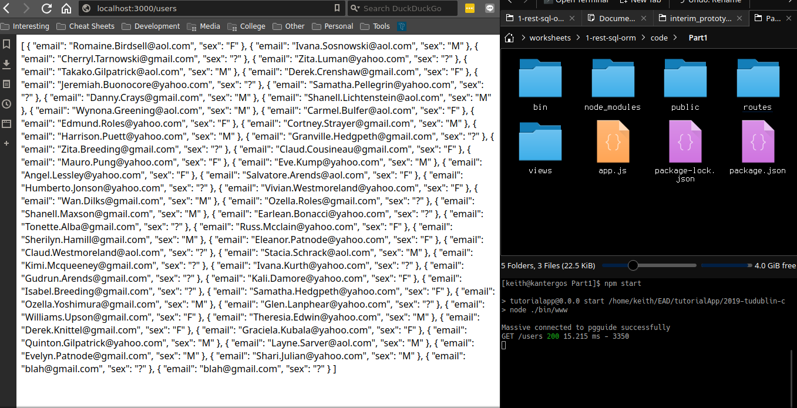

**All Products**
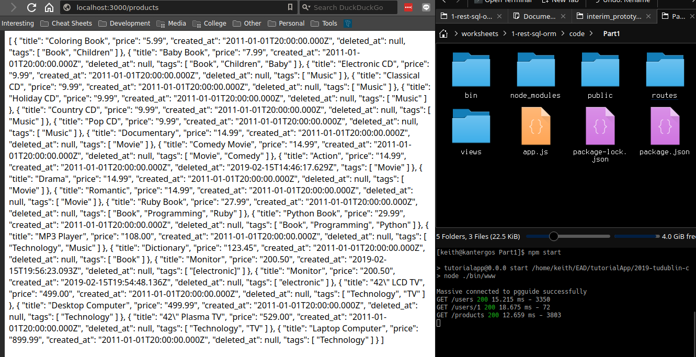

**Product By ID**
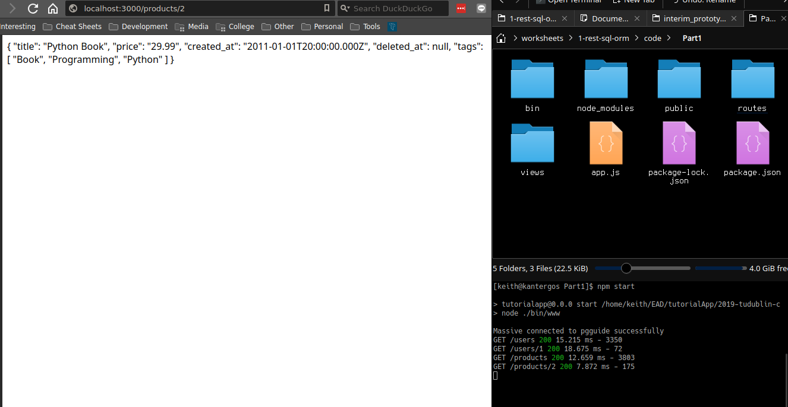

**All Purchases**

## Part 2

Code with SQL Injection vulnerability

	const queryString = "SELECT * FROM products WHERE title=\'" + req.query.name + "\';";

	req.app.get('db').query(queryString)
	.catch( err => { console.log('Failed to load products from DB'); })
	.then( products => {
	res.send(JSON.stringify(products, null, 2));
	});
	
**Exploit URL**: localhost:3000/products?name=Dictionary'%20OR'1'='1

This works because the URL closes the string after Dictionary and then opens another one to compare if '1' equals '1', which it always will and thus will return every row in the products table.

**SQL Injection In Action**
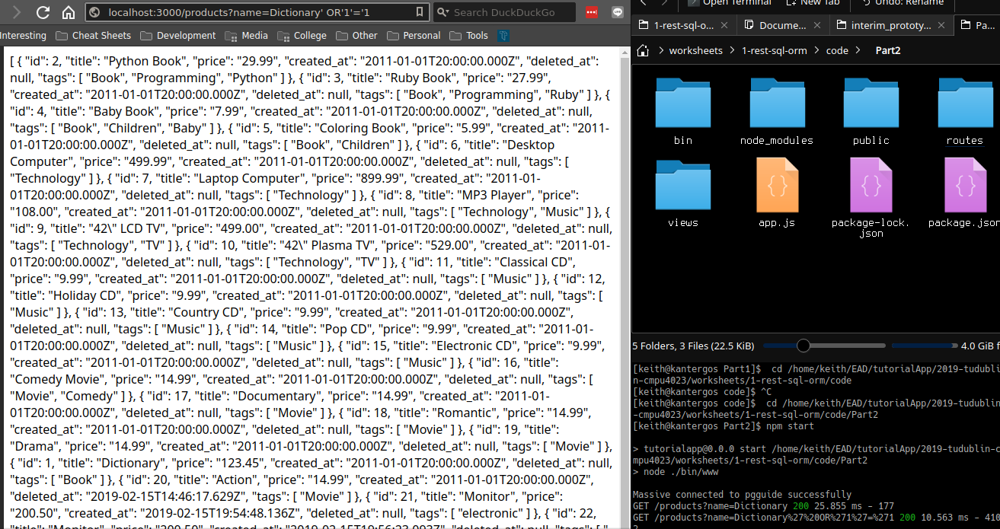

## Part 3

### Solution 1

The first solution is to use a parameterised query, code for which is shown below:

	req.app.get('db').products.find({
		title: req.query.name
	},
	{
		fields: ['title', "price", "created_at", "deleted_at", "tags"],
		order: [{
		    field: 'price',
		    direction: 'asc',
		    nulls: 'last'
	}]
	})
	.catch( err => { console.log('Failed to load products from DB'); })
	.then( products => {
		res.send(JSON.stringify(products, null, 2));
	} );

This binds the data passed in from the client to the title field on the database. Regardless of what the client passes in, it will only ever me matched to title since it is not embedded inside a string anymore.

### Solution 2

The second solution is using a stored procedure. For this, you need to write a stored procedure to get the data you want and then call it from Massive.js.

Code for both is below. 

	CREATE OR REPLACE FUNCTION getProduct(productName text) RETURNS Products
	AS $$
	DECLARE 
		prod Products%ROWTYPE;
	BEGIN
		SELECT * INTO prod FROM products WHERE title=productName;
		return prod;
	END $$ language plpgsql;

And the code that invokes it...

	req.app.get('db').query(
		'select getProduct('$1')',
		[req.query.name]
		).then(products => {
		    res.send(JSON.stringify(products, null, 2));
	    });

#### Test Screenshot

**SQL Injection Exploit Fix**

Now an empty JSON array is returned as no data was matched.

## Part 4

To configure the project for Sequelize, I first created config.js in the root directory and put in the following code

	const Sequelize = require('sequelize');

	const dbName = 'pgguide';
	const dbUsername = 'keith';
	const dbPassword = 'mypassword';
	const dbHost = 'localhost';
	const dbDialect = 'postgres';

	const sequelize = new Sequelize(dbName, dbUsername, dbPassword, {
	    host: dbHost,
	    dialect: dbDialect
	});

	sequelize
	  .authenticate()
	  .then(() => {
	    console.log('Connection has been established successfully.');
	  })
	  .catch(err => {
	    console.error('Unable to connect to the database:', err);
	  });

	sequelize.sync({force: false}).then(() => {
	  console.log('Successfully synced to DB');
	});

	const database = {
	    sequelize: sequelize,
	    Sequelize: Sequelize,
	    user: require('./models/userModel.js')(sequelize, Sequelize),
	    product: require('./models/productModel.js')(sequelize, Sequelize),
	    purchase: require('./models/purchaseModel.js')(sequelize, Sequelize),
	    purchaseItem: require('./models/purchaseItemModel.js')(sequelize, Sequelize)
	};

	module.exports = database;

This connects to my database, tests the connection, syncs the data and exports the database object with can be used to access the models that I defined for User, Product, Purchase and PurchaseItem.

Then I created two folders in the root directory, 'controllers' and 'models'. For each of the above entities I defined a model and a controller. As an example both are shown for User below. The rest can be found in the code in folder Part456. 

**userModel.js**

	module.exports = (sequelize, Sequelize) => {
	    const User = sequelize.define('users', {
		id: {
		    type: Sequelize.UUID,
		    primaryKey: true
		},
		email: Sequelize.STRING,
		password: Sequelize.STRING,
		details: Sequelize.STRING
	    },{
		timestamps: true,
		createdAt: 'created_at',
		deletedAt: 'deleted_at',
		updatedAt: false,
		paranoid: true
	    });
	    
	    return User;
	}

**userController.js**

	const User = require('../config.js').user;

	exports.create = (user, res) => {
	    
	    /* Validate Input */
	    if(user.email == null){
		res.send('Email must be specified for User'); 
		return;
	    }
	    
	    User.create({
		email: user.email,
		password: user.password,
		details: user.details
	    }, {
		fields: ['email', 'password', 'details']
	    }).then( user => {
		res.send( JSON.stringify(user, null, 2) );
	    });
	};

	exports.findAll = (req, res) => {
	    User.findAll({
		// Don't show hashed password
		attributes: ['id', 'email', 'details']
	    }).then(users => {
		res.send( JSON.stringify( users, null, 2 ) );
	    });
	};

	exports.findByPk = (req, res) => {
	    User.findOne({ 
		where: { id: req.params.id },
		// Don't show hashed password
		attributes: ['id', 'email', 'details']
	    }).then(user => {
		    res.send( JSON.stringify( user, null, 2 ) );
	    });
	};

The last thing was to specify associations between entities to ensure database integrity, code shown below:

**purchaseItemModel.js**

	PurchaseItem.belongsTo(Purchase, {foreignKey: 'purchase_id'});
	PurchaseItem.belongsTo(Product, {foreignKey: 'product_id'});

**purchaseModel.js**

	Purchase.belongsTo(User, {
        	foreignKey: 'user_id',
        	targetKey: 'id'
    	}); 

In the options parameter, I specify the foreignKey(The name of the key that references another table) and the targetKey(The name of the key that is referenced in another table).

## Part 5

For this I just implemented the POST method for the entity to allow for new instances to be created. Product shown below as an example.

**products.js**

	/*  TEST
	 *  curl -X POST -d title=Monitor -d price=200.50 -d tags='["electronic"]' localhost:3000/products */
	router.post('/', (req, res) => {
	    ProductController.create({
		title: req.body.title,
		price: req.body.price,
		tags: JSON.parse(req.body.tags)
	    }, res);
	});

**productController.js**

	exports.create = (product, res) => {
		/* Removed validation to shorten */
		Product.create({
			title: product.title,
			price: product.price,
			tags: product.tags
		},{
			fields: ['title', 'price', 'tags']
		}).then( product => {
			res.send( JSON.stringify( product, null, 2 ) );
		})
	};

### Test Screenshots

**Create Product**
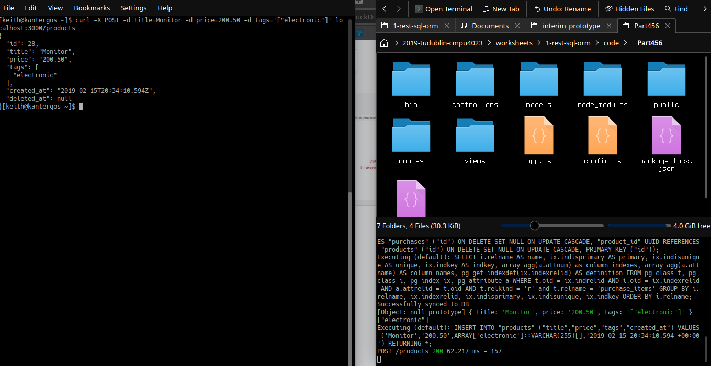

**Create User**
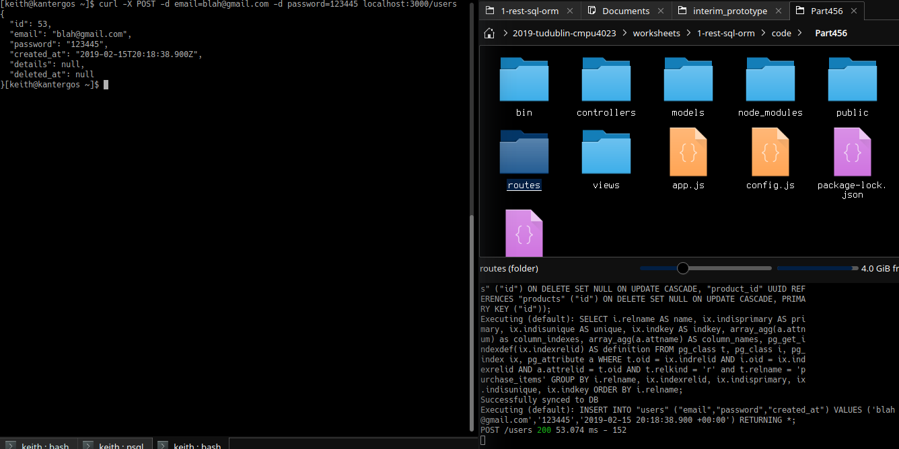

## Part 6

Below is the code for **PUT /products/:id** and **DELETE /products/:id** since the rest has already been covered.

**products.js**

	router.put('/:id', (req, res) => {
	    ProductController.update(req, res);
	});

	router.delete('/:id', (req, res) => {
	    ProductController.deleteByPk(req, res);
	});

**productController.js**

	exports.deleteByPk = (req, res) => {
	    Product.destroy({ 
		where: { id: req.params.id },
	    }).then(numDeleted => {
		res.send( numDeleted + ' products deleted' );
	    })
	};

	exports.update = (req, res) => {
	    
	    Product.update(req.body, { 
		where: { id: req.params.id }
	    }).then(numUpdated => {
		if(numUpdated == 1)
		    exports.findByPk(req, res);
		else 
		    res.send("Failed to update product");
	    })
	};

### cURL Commands for testing

GET /products[?name=string] 

	curl localhost:3000/products?name=Dictionary
	
**Product By Name**
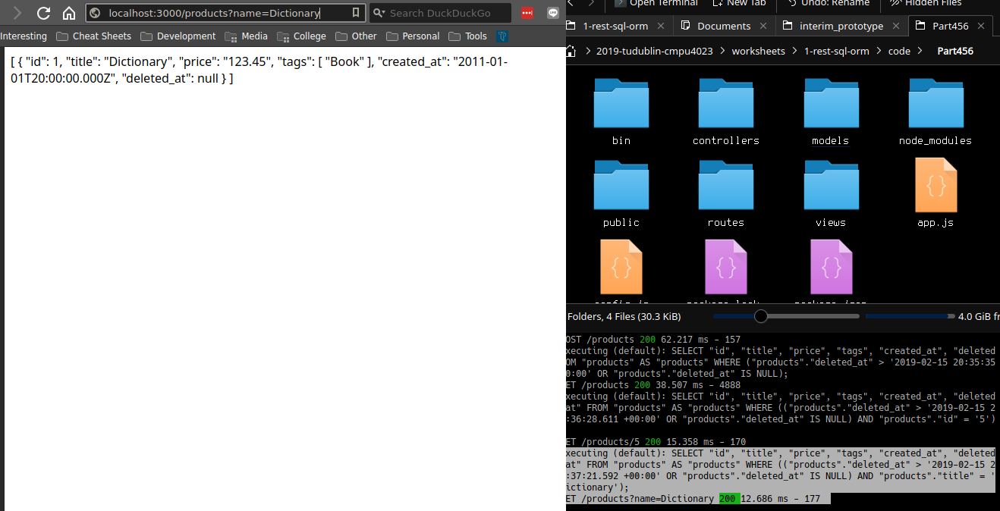

GET /products/:id

	curl localhost:3000/products/1
	
**Get Product By ID**
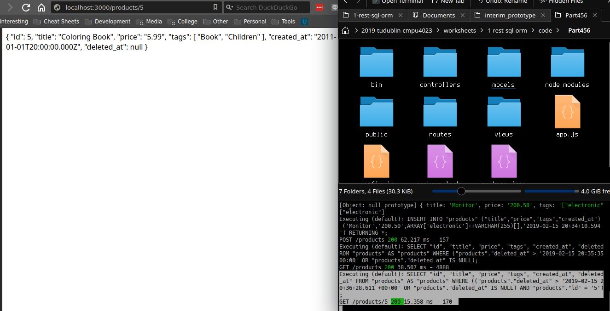

POST /products

	curl -X POST -d title=Monitor -d price=200.50 -d tags='["electronic"]' localhost:3000/products
	
**Create Product With Post**
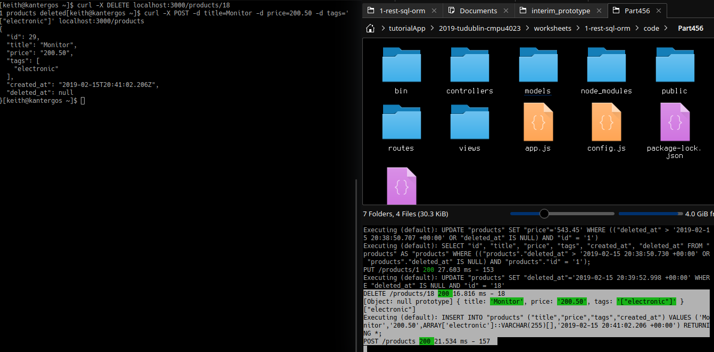

PUT /products/:id

	curl -X PUT -d price=543.45 localhost:3000/products/1
	
**Update Product With PUT**
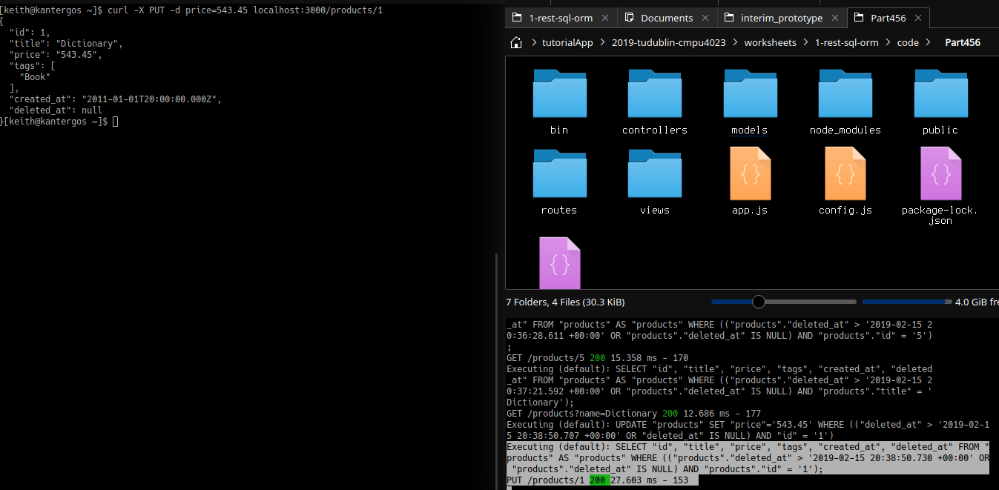

DELETE /products/:id

	curl -X DELETE localhost:3000/products/19
	
**Delete Product By ID With DELETE**
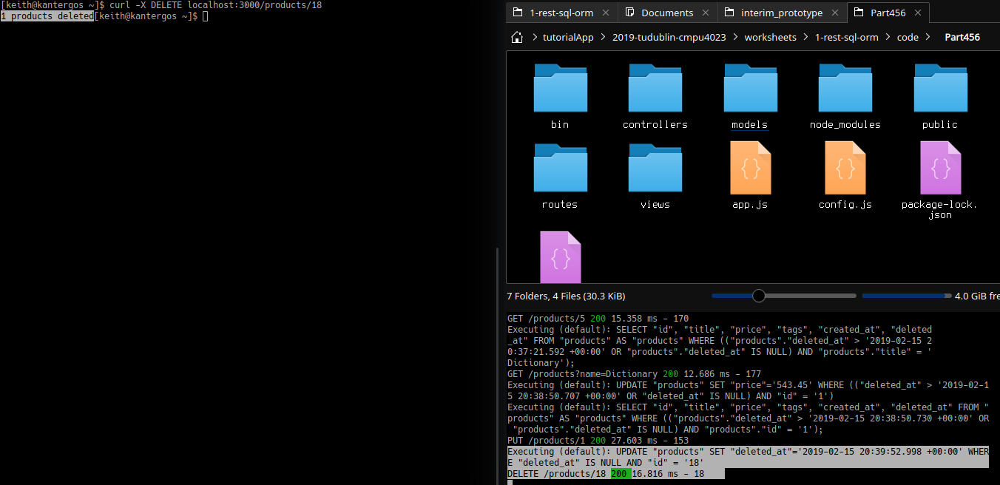
	

