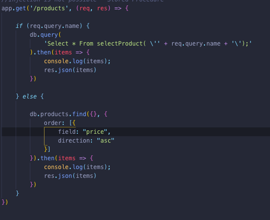

Add any additional documentation here...# Enterprise Application Development - Lab 1

#

#

#### 1. Create a REST Server using Node, Express and Massive

- GET /users
  
  

- GET /users/:id
  
  

- GET /products
  
  

- GET /products/:id
  
  

- GET /purchases
  
  

#### 2. SQL Injection

- GET /products/[?name=string]
  
  

#### 3. Solutions for SQL Injection

- Parameterised Query
  

- Stored Procedure
  
  

#### 4. Sequelize ORM

- Users: model and migration
  
  

- Products: model and migration
  
  

- Purchases: model and migration
  
  

- Purchased items: model and migration
  
  

#### 5. Populate Database

#### 6. RESTful API using Sequelize

- GET /products[?name=string]
  
  
  

- GET /products/:id
  
  

- POST /products
  
  

- PUT /products/:id
  
  

- DELETE /products/:id
  
  
