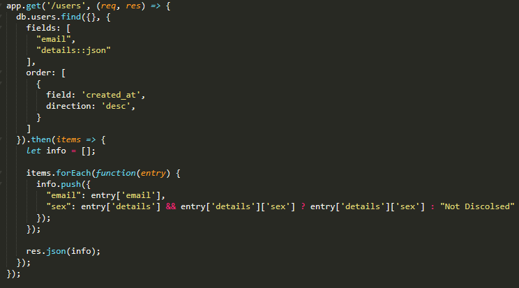
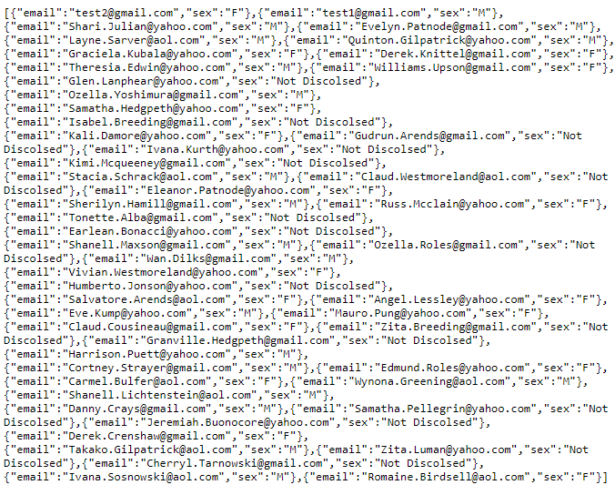
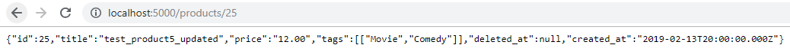

# **Thomas Delaney C15300756 - Enterprise Application Development Worksheet 1**

### 1.	Using Node, Express and Massive create the following HTTP API endpoints serving the following resources as JSON documents
#### - List all users email and sex in order of most recently created. Do not include password hash in your output

The route will find all the users email and details, in a JSON format so we can parse the sex out later. When the items are returned we create an empty array to store the output, and loop over the items. We check if the details are null, if not then we push an object with the email, and the sex from the details JSON. If the user details were null then we push an object with the email and the sex will be marked “Not Disclosed”. 

When requested from the browser, the output was as follows.

#### - Show above details of the specified user

This is similar to the previous solution; the difference is we take the id as parameter for the URL which is accessed using req.params
.id. We then include this id in the database request which will only return data for the user with that id. Output is as follows:

#### - List all products in ascending order of price

The “if”part of this code will be used for part 2 of the worksheet. However the query here will find all the products, and then order them by the price field, in ascending order/direction. Output looks like:

#### - Show details of the specified products

This is similar to get users using id solution; the parameter is taken in via the URL and used to query the product. Output is as follows:

#### - List purchase items to include the receiver’s name and, address, the purchaser’s email address and the price, quantity and delivery status of the purchased item. Order by price in descending order

This query needed to be done using a raw query, as massive.js querying functions does not support joins. This query will select all fields required and will join purchases to purchase items, ordering the fields by price in descending order. Output is as follows:

------------

### 2. SQL Injection

This is the full query based on the previous query to get purchases. Using req.query.name we can get the query name parameter. If it is included then we go into the else bracket of this code snippet. “q2” is an unsafe query, it just concatenates the parameter into the query then executes it. This allows the injection query (commented out in the snippet) to be added into the query.

Output before injection:

Coloring Book exists, but when we include the injection query:

When Colouring Book is now queried, it is empty, like so, it, and all its purchase items, have been deleted.

------------

### 3. Two solutions to eliminate the security hole
#### - Parameterized Query

The parameterized query looks like this, the $1 relates to the first element in the passed in array, which includes the parameter name. This provides extra protection against SQL injections as it includes its own use of quotes to avoid injection of quotes. When the query is ran with the same injection query (using Laptop Computer as the title), the row still remains, even with the same output as when executed with an unsafe query.

The stored procedure is a function that is declared as “LANGUAGE SQL STRICT IMMUTABLE” which means that no update or delete operations can occur. The function will look like this:

It is executed in the JavaScript like so:

And the output is as follows:

------------

### 4 and 5. Sequalized Models

All the models are somewhat built like this, this is the purchase_item model, **paranoid: false** ensures that deleted_at is not included, however it would be set to true for models that include this (user, product). **updatedAt: false** ensures that updatedAt is note included in any queries on the model. **underscored: true** allows for attributes with underscores. **purchase_item.belongsTo(models.purchase);** and **purchase_item.belongsTo(models.product);** associations tells the model that it has references to products and purchases. In the respective purchase table, it would include the association **purchase.hasMany(models.purchase_item);**. 

------------

### 6. API using Sequalize.js
#### - List all products

If name is defined then we use models.products.find and a where clause to query the database using the parameter name. Output is:

#### - Show details of the specified products

Where clause and parameter id used to query the specified product, result is:

#### - Create a new product instance

The router post function lets us post a product instance, the models.product.create will use the sequalized product model to create an instance and add it to the database. The CURL command and result is as follows:

And when queried using the ID we can see that the instance has indeed been created:

#### - Update an existing product

To update a product, you select a product then use the updateAttributes method to update the rows attributes with the PUT request body data. CURL command looks like (updating test_product5 to test_product5_updated):

#### - Delete an existing product

To delete a product, you select a product then use the destroy method to delete the row. Since the product ‘s id is a foreign key in the purchase_items table, we need to delete all rows where the id is used in purchase_items. 

Using the ID 20 (Action), the result is as follows:

The result is as follows if searched in the browser:

