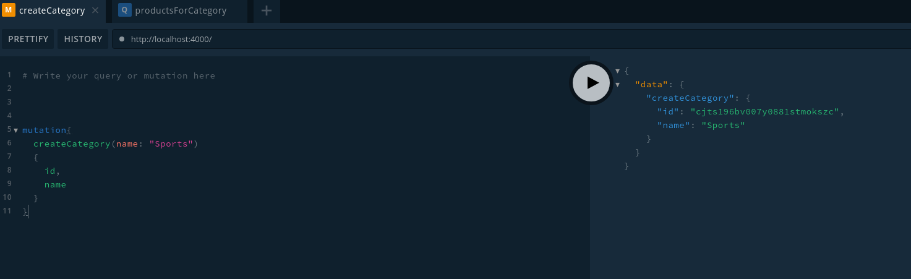
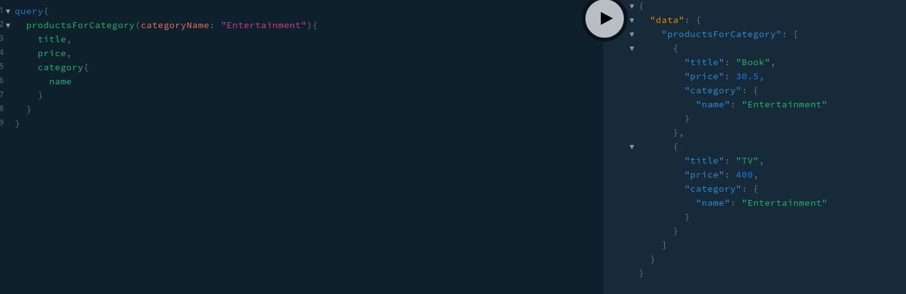
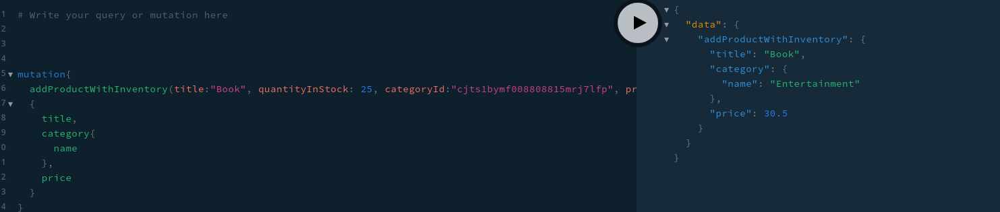

# Enterprise Application Development Week 3

## Keith Chambers - C15324461

**Usage**:

	npm install
	prisma deploy
	prisma generate
	node index.js

### Part 1

**Using using graphql-yoga and the ERD below, construct a graphql schema using any four relations of your choice having the relationships depicted.**

Chosen:

- reorder
- inventory
- products
- categories

		type Reorder {
		    product: Product!
		    date_low: DateTime!
		    quan_low: Int!
		    date_reordered: DateTime!
		    quan_reordered: Int!
		    date_expected: DateTime!
		}

		type Inventory {
		    product: Product! @unique
		    quan_in_stock: Int!
		    sales: Int
		}

		type Product {
		    id: ID! @unique
		    category: Category
		    title: String!
		    actor: String
		    price: Float!
		    special: Int
		    common_products: [Product!]
		}

		type Category {
		    id: ID! @unique
		    name: String! @unique
		}

### Part 2

**Build a GraphQL query resolver which returns some set of the the attributes from a single database relation.**

Some basic query resolvers(From source):

	    productsForCategory(root, args, context){
		return context.prisma.products({
		    where: { category: { name: args.categoryName } } 
		})
	    },
	    category(root, args, context){
		return context.prisma.category({
		    id: args.categoryId
		})
	    },
	    product(root, args, context){
		return context.prisma.product({
		    id: args.productId
		})
	    },
	    inventory(root, args, context){
		return context.prisma.inventory({
		    where: { product: { id: args.productId } }
		})
	    },
	    allCategories(root, args, context){
		return context.prisma.categories();
	    },
	    allProducts(root, args, context){
		return context.prisma.products();
	    },
	    
### Part 3

** Build a GraphQL query resolver which returns the attributes from 3 joined database relations having 2 levels of nesting in the resultant output**

**Briefly, describe an application of the query you have chosen to write as a comment in your resolver code **

	query {
	  productsForCategory(categoryName:"EXAMPLE_CATEGORY")
	  {
	    title,
	    price
	  }
	}

### Part 4

**Create a mutation resolver to add data the database. Your mutation should update at least two relations (of your choice)**

**Briefly, describe an application of the query you have chosen to write as a comment in your resolver code**

	addProductWithInventory(root, args, context){
        const newProduct = context.prisma.createProduct({
            title: args.title,
            category: {
                connect: { id: args.categoryId }
            },
            price: args.price,
            actor: args.actor,
            special: args.special
        });
        
        const inventory = context.prisma.createInventory({
            product: {
                connect: { id: newProduct.id }
            },
            quan_in_stock: args.quantityInStock,
            sales: 0
        });
        
        return newProduct;
    }

Signature for usage:

	addProductWithInventory(title: String!, categoryId: ID!, price: Float!, actor: String, special: Int, quantityInStock: Int) : Product
	
Automatically creates an inventory value for the product. Useful so that product and inventory are kept more in sync and you won't forget to specify what inventory of the product there is.

Inventory stock is passes as the last parameter quantityInStock. Sales will be set to 0 in the inventory table as product is new.

### Part 5

**Set up a running GraphQLServer from the graphql-yoga library to test and demonstrate your resolver queries and mutations you implemented in sections 2-4 above**

Screen shots of usage.

**Creating a new category**

**Getting all products for a given category [Part 3]**

**Creating a product and inventory [Part 4]**

