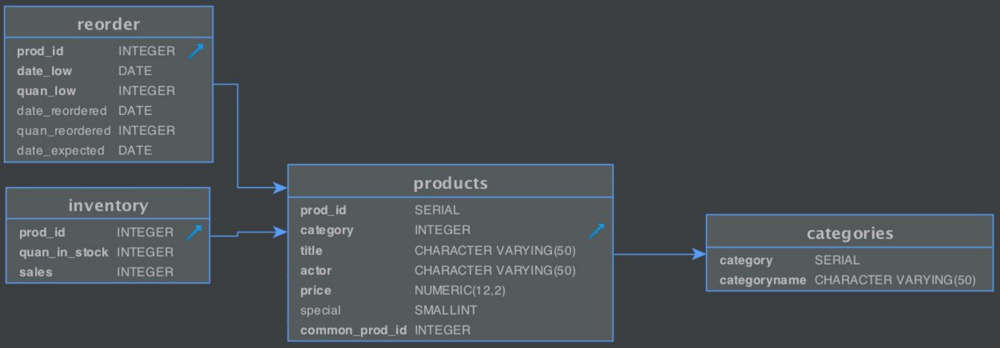
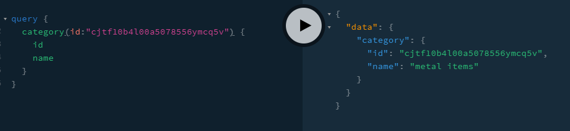

# Lab 3 - GraphQL
### Part 1
The implemented relations

The data model code

The qraphql code

### Part 2
Resolver for basic query 

Query returns a number of attributes

### Part 3
What it does: Displays a detailed breakdown of a product in the system, including it's name, price, category, amount currently in stock and amount sold.
Resolver for query that deals with two relations

Resolver for building connections

Query output showing two connected realtions

### Part 4
What it does: Makes it possible to generate a reorder in the system when quantities become too low and associate it with a product.
Order table was not selected so this mutator deals with creating a reorder instead, the reorder details are updated with dates, quantities and the connection to the products table.

The output of the modified relations

